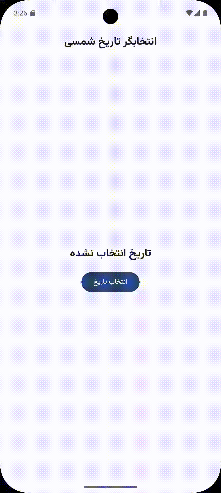

# 📅 Persian Date Picker – Kotlin Multiplatform

A **Persian (Jalali/Shamsi) Date Picker** built with **Jetpack Compose Multiplatform** 🎉
This library provides beautiful Material 3 styled dialogs and pickers for selecting **single dates** and **date ranges** in the **Persian calendar**. Developed following **Material Design Components** guidelines.

---

## ✨ Features
[](LICENSE)
[](https://kotlinlang.org/lp/multiplatform/)


* 📌 **Persian (Jalali) calendar**
* 🖼️ Material 3 design components
* 📱 Works on Android,iOS, Desktop, and WASM Compose Multiplatform targets
* 🎛️ Supports both **date picker** and **date range picker**
* 🔄 Fully customizable colors, shapes, and typography
* ⚡ Easy-to-use APIs

---

## 🚀 Installation
The library is published to Maven Central. 

The library is compatible with the Kotlin Standard Library not lower than 2.1.20. 

If you target Android devices running below API 26, you need to use Android Gradle plugin 4.0 or newer and enable core library desugaring.

⚠️ Note: This library depends on the latest version of [`kotlinx-datetime`](https://github.com/Kotlin/kotlinx-datetime) and [`PersianDateTime`](https://github.com/faridsolgi/PersianDateMultiplatform), so make sure to always use the most recent release.

```kotlin
implementation("io.github.faridsolgi:persian-date-picker:<latest-version>")
implementation("io.github.faridsolgi:persianDateTime:<latest-version>")
implementation("org.jetbrains.kotlinx:kotlinx-datetime:<latest-version>")
```

👉 Replace `<latest-version>` with the latest release versions from GitHub or Maven Central.

---

## 📸  Screen Recordings

## Recording 1


## Recording 2


## Recording 3


## Recording 4


## Recording 5


---

## 📖 Usage Examples

### 🔹 1. Simple **Persian Date Picker Dialog**

```kotlin
val state = rememberPersianDatePickerState()
var showDialog by remember { mutableStateOf(false) }

if (showDialog) {
    PersianDatePickerDialog(
        onDismissRequest = { showDialog = false },
        confirmButton = {
            TextButton(onClick = {
                println("Selected date: ${state.selectedDate}")
                showDialog = false
            }) {
                Text("تایید")
            }
        }
    ) {
        PersianDatePicker(state = state)
    }
}

Button(onClick = { showDialog = true }) {
    Text("انتخاب تاریخ")
}
```

---

### 🔹 2. **Persian Date Range Picker Dialog**

```kotlin
val rangeState = rememberPersianDateRangePickerState()
var showDialog by remember { mutableStateOf(false) }

if (showDialog) {
    PersianDatePickerDialog(
        onDismissRequest = { showDialog = false },
        confirmButton = {
            TextButton(onClick = {
                println("Start: ${rangeState.selectedStartDate}")
                println("End: ${rangeState.selectedEndDate}")
                showDialog = false
            }) {
                Text("تایید")
            }
        }
    ) {
        PersianDateRangePicker(state = rangeState)
    }
}

Button(onClick = { showDialog = true }) {
    Text("انتخاب بازه تاریخ")
}
```

---

### 🔹 3. **Date Picker Popup**

```kotlin
val state = rememberPersianDatePickerState()
var expanded by remember { mutableStateOf(false) }

PersianDatePickerPopup(
    expanded = expanded,
    onDismissRequest = { expanded = false },
    anchor = {
        Button(onClick = { expanded = true }) {
            Text("انتخاب تاریخ")
        }
    }
) {
    PersianDatePicker(state = state)
}
```

---

### 🔹 4. **Range Picker Popup**

```kotlin
val rangeState = rememberPersianDateRangePickerState()
var expanded by remember { mutableStateOf(false) }

PersianDatePickerPopup(
    expanded = expanded,
    onDismissRequest = { expanded = false },
    anchor = {
        Button(onClick = { expanded = true }) {
            Text("انتخاب بازه تاریخ")
        }
    }
) {
    PersianDateRangePicker(state = rangeState)
}
```

---

### 🔹 5. **Customizing Title & Headline**

```kotlin
val state = rememberPersianDatePickerState()

PersianDatePickerDialog(
    onDismissRequest = {},
    confirmButton = { TextButton(onClick = {}) { Text("تایید") } }
) {
    PersianDatePicker(
        state = state,
        title = {
            Text(
                text = "📅 انتخاب تاریخ",
                style = MaterialTheme.typography.headlineMedium,
                modifier = Modifier.padding(16.dp)
            )
        },
        headline = {
            Text(
                text = state.selectedDate?.toString() ?: "هیچ تاریخی انتخاب نشده",
                style = MaterialTheme.typography.bodyLarge,
                modifier = Modifier.padding(16.dp)
            )
        }
    )
}
```

---

### 🔹 6. **Custom Year Range & Initial Date**

```kotlin
val state = rememberPersianDatePickerState(
    initialSelectedDate = PersianDateTime.now(),
    yearRange = 1300..1500 // Restrict to a custom range
)

PersianDatePickerDialog(
    onDismissRequest = {},
    confirmButton = { TextButton(onClick = {}) { Text("تایید") } }
) {
    PersianDatePicker(state = state)
}
```

---

### 🔹 7. **Range Picker with Custom Headline**

```kotlin
val rangeState = rememberPersianDateRangePickerState()

PersianDatePickerDialog(
    onDismissRequest = {},
    confirmButton = { TextButton(onClick = {}) { Text("تایید") } }
) {
    PersianDateRangePicker(
        state = rangeState,
        headline = {
            Column(modifier = Modifier.padding(16.dp)) {
                val start = rangeState.selectedStartDate?.toLocalDate()
                val end = rangeState.selectedEndDate?.toLocalDate()
                if (start != null && end != null) {
                    val days = start.daysUntil(end)
                    Text("📆 شروع: $start")
                    Text("📆 پایان: $end")
                    Text("⏳ فاصله: $days روز")
                } else {
                    Text("هیچ بازه‌ای انتخاب نشده")
                }
            }
        }
    )
}
```

---

### 🔹 8. **Custom Colors**

By default, the colors of the `PersianDatePicker` depend on your Material app theme. You can customize the colors using the `PersianDatePickerDefaults.colors` function.  

**Example:**

```kotlin
val state = rememberPersianDatePickerState()

PersianDatePickerDialog(
    onDismissRequest = {},
    confirmButton = { TextButton(onClick = {}) { Text("تایید") } }
) {
    PersianDatePicker(
        state = state,
        colors = PersianDatePickerDefaults.colors(
            containerColor = Color.Unspecified,
            titleColor = Color.Unspecified,
            confirmButtonColor = Color.Unspecified,
            dismissButtonColor = Color.Unspecified,
            selectedDayColor = Color.Unspecified,
            onSelectedDayColor = Color.Unspecified,
            notSelectedDayColor = Color.Unspecified,
            todayColor = Color.Unspecified,
            weekdaysColor = Color.Unspecified
        )
    )
}


## 🎨 Customization

You can customize:

* 🟦 **Colors** → `PersianDatePickerDefaults.colors()`
* 🔷 **Shape** → `PersianDatePickerDefaults.Shape`
* 📐 **Year Range** → pass `yearRange` to `rememberPersianDatePickerState()` or `rememberPersianDateRangePickerState()`
* 🪟 **Dialog Properties** → `DialogProperties`
* 🎭 **Headlines & Titles** → Provide your own Composables

---

## 🤝 Contributing

Contributions are welcome!
Feel free to **open issues** or **submit pull requests** to improve functionality, fix bugs, or add new features.

---

## 📜 License

This project is licensed under the **MIT License**.
